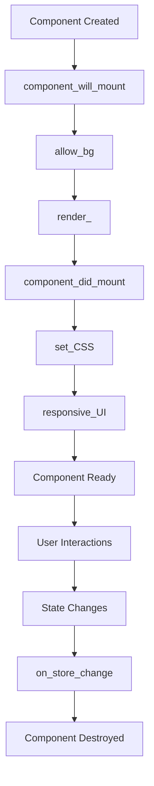

## Overview

The PPG component lifecycle provides **clear hooks for every stage** of a component's life. Each lifecycle method serves a specific purpose and executes at a precise moment, giving you fine-grained control over your component's behavior.

<Info>
When you use the `@init_lifecycle` decorator, these methods are called automatically in the correct order during component initialization.
</Info>

## Lifecycle Flow

Here's the complete lifecycle flow for a PPG component:



## Mounting Phase

### component_will_mount()

Called **before** the component renders. This is where you:
- Initialize state and data structures
- Subscribe to global stores
- Define state schemas
- Set up component configuration

```python
from ppg_runtime.application_context import Pydux, PPGLifeCycle, init_lifecycle
from PySide6.QtWidgets import QMainWindow

@init_lifecycle
class MyComponent(QMainWindow, PPGLifeCycle, Pydux):
    def component_will_mount(self):
        # Subscribe to global state updates
        self.subscribe_to_store(self)
        
        # Define the state schema
        self.set_schema({
            "greeting": str,
            "count": int
        })
        
        # Initialize local variables
        self.api_client = APIClient()
        self.data_cache = {}
```

<Warning>
Do NOT create widgets in `component_will_mount()`. Widget creation should happen in `render_()`. This method is only for initialization logic.
</Warning>

### allow_bg()

Automatically called to enable background styling on the component. This method sets the `WA_StyledBackground` attribute, allowing CSS background colors and images to work correctly.

```python
def allow_bg(self):
    # This is handled automatically by PPGLifeCycle
    # You typically don't need to override this
    self.setAttribute(Qt.WA_StyledBackground, True)
```

<Note>
The `allow_bg()` method is provided by `PPGLifeCycle` and works across PySide6, PySide2, PyQt6, and PyQt5 automatically.
</Note>

### render_()

The **core rendering method** where you create and configure your UI elements. This is where the visual structure of your component comes to life.

```python
def render_(self):
    # Create standard Qt widgets
    self.label = QLabel('Hello World!', self)
    self.text_input = QTextEdit(self)
    self.button = QPushButton('Submit', self)
    
    # Configure widget properties
    self.text_input.setPlaceholderText('Type something...')
    
    # Connect signals
    self.button.clicked.connect(self.on_submit)
    self.text_input.textChanged.connect(
        lambda: self.update_store({"greeting": self.text_input.toPlainText()})
    )
```

#### Using Reactive Widgets

You can also use reactive widgets that automatically sync with your state:

```python
from ppg_runtime.ReactiveWidgets import Label, LineEdit, TextEdit
from PySide6.QtCore import Qt

def render_(self):
    # Reactive widgets auto-update when store changes
    Label(self, key="greeting", alignment=Qt.AlignCenter).move(20, 20)
    LineEdit(self, key="greeting", placeholder="Enter greeting...").move(20, 60)
    TextEdit(self, key="notes", placeholder="Type notes...").setGeometry(20, 120, 600, 300)
```

### component_did_mount()

Called **after** the component has been fully rendered. This is where you:
- Fetch initial data from APIs
- Start timers or background processes
- Perform actions that require the UI to be ready
- Initialize third-party integrations

```python
def component_did_mount(self):
    # Fetch initial data
    self.load_user_data()
    
    # Start a timer for periodic updates
    self.timer = QTimer()
    self.timer.timeout.connect(self.refresh_data)
    self.timer.start(5000)  # Every 5 seconds
    
    # Initialize web engine if needed
    if hasattr(self, 'webview'):
        self.webview.loadFinished.connect(self.on_page_loaded)
```

## Styling Phase

### set_CSS()

Apply CSS styling to your component. This method is called after `component_did_mount()`.

```python
def set_CSS(self):
    self.setStyleSheet("""
        QMainWindow {
            background-color: #f5f5f5;
        }
        QLabel {
            color: #333;
            font-size: 16px;
            font-weight: bold;
        }
        QPushButton {
            background-color: #007bff;
            color: white;
            border: none;
            padding: 10px 20px;
            border-radius: 4px;
        }
        QPushButton:hover {
            background-color: #0056b3;
        }
    """)
```

You can also load CSS from external files:

```python
def set_CSS(self):
    css_path = self.get_resource('styles', 'main.css')
    with open(css_path, 'r') as f:
        self.setStyleSheet(f.read())
```

## Layout Phase

### responsive_UI()

Handle responsive layouts and positioning. This method is called:
- After initial mount (automatically)
- Whenever the window is resized (via `resizeEvent`)

```python
def responsive_UI(self):
    # Set minimum window size
    self.setMinimumSize(640, 480)
    
    # Position widgets
    self.label.move(20, 20)
    self.text_input.setGeometry(20, 60, 600, 200)
    self.button.move(20, 280)
    
    # Calculate responsive sizes using calc() helper
    button_width = self.calc(self.width(), 50)  # 50% of window width
    self.button.resize(button_width, 40)
```

#### Responsive Layout Example

```python
def responsive_UI(self):
    window_width = self.width()
    window_height = self.height()
    
    # Header takes 10% of height
    header_height = self.calc(window_height, 10)
    self.header.setGeometry(0, 0, window_width, header_height)
    
    # Sidebar takes 20% of width
    sidebar_width = self.calc(window_width, 20)
    self.sidebar.setGeometry(0, header_height, sidebar_width, window_height - header_height)
    
    # Content area fills remaining space
    content_x = sidebar_width
    content_y = header_height
    content_width = window_width - sidebar_width
    content_height = window_height - header_height
    self.content.setGeometry(content_x, content_y, content_width, content_height)
```

<Note>
The `responsive_UI()` method is automatically called when the window is resized because `PPGLifeCycle` overrides `resizeEvent()`.
</Note>

## Update Phase

### on_store_change(store)

Called whenever the global Pydux store changes. This is where you update your UI based on state changes.

```python
def on_store_change(self, store):
    # Update UI when state changes
    greeting = self.store.get("greeting", "")
    self.label.setText(greeting)
    self.label.adjustSize()
    
    # Handle nested state
    count = self.get_nested("user.loginCount")
    if count > 0:
        self.status_label.setText(f"Logged in {count} times")
```

<Info>
If you're using reactive widgets, they update automatically and you don't need to manually update them in `on_store_change()`.
</Info>

### Re-rendering with _trigger_render()

When state changes significantly, you can trigger a complete re-render:

```python
def on_store_change(self, store):
    # Check if re-render is needed
    if self.store.get("theme") != self.current_theme:
        self._trigger_render()
```

The `_trigger_render()` method:
1. Clears all child widgets
2. Calls `allow_bg()`
3. Calls `render_()` again
4. Calls `responsive_UI()`
5. Calls `component_did_mount()`
6. Calls `set_CSS()`
7. Ensures all children are visible

<Warning>
`_trigger_render()` completely rebuilds your UI. Use it sparingly for major state changes. For simple updates, prefer updating individual widgets in `on_store_change()`.
</Warning>

## Unmounting Phase

### destroyComponent()

Safely destroy a component and clean up resources:

```python
def close_modal(self):
    # Clean up resources before destroying
    if hasattr(self, 'timer'):
        self.timer.stop()
    
    # Unsubscribe from store
    self.unsubscribe_from_store(self)
    
    # Destroy the component
    self.modal.destroyComponent()
```

The `destroyComponent()` method:
- Removes the widget from its parent
- Schedules it for deletion with `deleteLater()`

## Complete Lifecycle Example

Here's a complete example showing all lifecycle methods:

```python
from ppg_runtime.application_context import PPGLifeCycle, Pydux, init_lifecycle
from ppg_runtime.ReactiveWidgets import Label, LineEdit
from PySide6.QtWidgets import QMainWindow, QPushButton
from PySide6.QtCore import QTimer

@init_lifecycle
class UserProfile(QMainWindow, PPGLifeCycle, Pydux):
    def component_will_mount(self):
        # Subscribe to state changes
        self.subscribe_to_store(self)
        
        # Define state schema
        self.set_schema({
            "username": str,
            "status": str,
            "lastLogin": str
        })
        
        # Initialize variables
        self.api = UserAPI()
        self.current_theme = "light"
    
    def render_(self):
        # Create reactive widgets
        Label(self, key="username", text="User: {username}").move(20, 20)
        Label(self, key="status", text="Status: {status}").move(20, 60)
        
        # Create standard widgets
        self.refresh_btn = QPushButton("Refresh", self)
        self.refresh_btn.clicked.connect(self.load_user_data)
    
    def component_did_mount(self):
        # Load initial data
        self.load_user_data()
        
        # Start auto-refresh timer
        self.timer = QTimer()
        self.timer.timeout.connect(self.load_user_data)
        self.timer.start(30000)  # Every 30 seconds
    
    def set_CSS(self):
        self.setStyleSheet("""
            QLabel {
                font-size: 14px;
                color: #333;
            }
            QPushButton {
                background-color: #28a745;
                color: white;
                border-radius: 4px;
                padding: 8px 16px;
            }
        """)
    
    def responsive_UI(self):
        self.setMinimumSize(400, 300)
        self.refresh_btn.move(20, 100)
        
        # Responsive button width
        btn_width = self.calc(self.width(), 90)
        self.refresh_btn.resize(btn_width, 40)
    
    def load_user_data(self):
        # Fetch from API and update store
        data = self.api.get_current_user()
        self.update_store({
            "username": data['name'],
            "status": data['status'],
            "lastLogin": data['last_login']
        })
    
    def on_store_change(self, store):
        # Additional UI updates if needed
        # Reactive widgets update automatically
        pass
```

## Best Practices

<Steps>
  <Step title="Keep render_() Pure">
    Only create and configure widgets in `render_()`. Don't fetch data or perform side effects here.
  </Step>
  
  <Step title="Use component_did_mount() for Side Effects">
    API calls, timers, and other side effects belong in `component_did_mount()`, not `render_()`.
  </Step>
  
  <Step title="Leverage Reactive Widgets">
    Use reactive widgets instead of manually updating UI in `on_store_change()` when possible.
  </Step>
  
  <Step title="Clean Up Resources">
    Always stop timers and unsubscribe from stores before destroying components.
  </Step>
  
  <Step title="Use responsive_UI() for Layouts">
    Keep all positioning and sizing logic in `responsive_UI()` for better maintainability.
  </Step>
</Steps>

## Next Steps

- Learn about [State Management](/concepts/state-management) with Pydux
- Explore [Reactive Widgets](/concepts/reactive-widgets) for automatic UI updates
- Build [Hybrid Applications](/concepts/hybrid-applications) combining native and web UIs