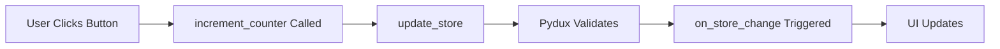

## What You'll Build

In this tutorial, you'll build a **Counter Application** that demonstrates PPG's core features:

- Component lifecycle hooks
- State management with Pydux
- Reactive widgets that auto-update
- Hot reloading for rapid development
- Styling with Qt stylesheets


<Note>
  This tutorial assumes you've completed the [Quick Start](/quickstart) guide and have a basic PPG project set up.
</Note>

## Project Setup

If you haven't already, create a new PPG project:

```bash
ppg init
```

Navigate to `src/main/python/main.py` — this is where we'll build our counter app.

## Understanding the Component Lifecycle

Before we start coding, let's understand PPG's component lifecycle. Every PPG component goes through these stages:

<Steps>
  <Step title="component_will_mount()">
    Called before the component renders. Perfect for:
    - Setting up initial state
    - Subscribing to the global store
    - Fetching data from APIs
    - Initializing variables
  </Step>
  
  <Step title="render_()">
    Builds the UI by creating and arranging widgets. This is where you:
    - Create Qt widgets (labels, buttons, inputs)
    - Set up layouts
    - Define the component structure
  </Step>
  
  <Step title="component_did_mount()">
    Called after the component has rendered. Use this for:
    - Connecting signals to slots
    - Starting timers
    - Operations that require rendered widgets
  </Step>
  
  <Step title="set_CSS()">
    Apply stylesheets to your components:
    - Define colors, fonts, and spacing
    - Style individual widgets
    - Load external CSS files
  </Step>
  
  <Step title="responsive_UI()">
    Handle responsive layouts:
    - Set window size constraints
    - Adjust layouts based on window size
    - Reposition elements
  </Step>
</Steps>

## Step 1: Define the State Schema

Pydux uses Pydantic for type-safe state management. Let's define our counter state:

```python main.py
import sys
from ppg_runtime.application_context.PySide6 import ApplicationContext
from ppg_runtime.application_context import PPGLifeCycle, Pydux, init_lifecycle
from ppg_runtime.application_context.devtools.reloader import hot_reloading
from ppg_runtime.application_context.utils import app_is_frozen
from PySide6.QtWidgets import QMainWindow, QLabel, QPushButton, QVBoxLayout, QWidget
from PySide6.QtCore import Qt

@init_lifecycle
@hot_reloading
class CounterApp(QMainWindow, PPGLifeCycle, Pydux):
    def component_will_mount(self):
        # Define the state schema
        self.set_schema({
            'count': int,
            'message': str
        })
        
        # Initialize the state
        self.update_store({
            'count': 0,
            'message': 'Click the buttons to change the count!'
        })
        
        # Subscribe to state changes
        self.subscribe_to_store(self)
```

### What's Happening?

- `set_schema()`: Defines the shape of our global state with type hints
- `update_store()`: Sets initial values for our state
- `subscribe_to_store()`: Tells this component to react to state changes

<Info>
  **Type Safety**: Pydux validates all state updates against the schema. Trying to set `count` to a string will raise a validation error.
</Info>

## Step 2: Build the UI

Now let's create the interface in the `render_()` method:

```python main.py
    def render_(self):
        # Create central widget and layout
        central_widget = QWidget(parent=self)
        self.setCentralWidget(central_widget)
        layout = QVBoxLayout(central_widget)
        layout.setAlignment(Qt.AlignCenter)
        layout.setSpacing(20)
        
        # Title label
        title = QLabel('Counter App', parent=central_widget)
        title.setObjectName('title')
        title.setAlignment(Qt.AlignCenter)
        layout.addWidget(title)
        
        # Counter display
        self.counter_label = QLabel(f"Count: {self.store['count']}", parent=central_widget)
        self.counter_label.setObjectName('counter')
        self.counter_label.setAlignment(Qt.AlignCenter)
        layout.addWidget(self.counter_label)
        
        # Message display
        self.message_label = QLabel(self.store['message'], parent=central_widget)
        self.message_label.setObjectName('message')
        self.message_label.setAlignment(Qt.AlignCenter)
        self.message_label.setWordWrap(True)
        layout.addWidget(self.message_label)
        
        # Increment button
        increment_btn = QPushButton('Increment (+1)', parent=central_widget)
        increment_btn.setObjectName('incrementBtn')
        increment_btn.clicked.connect(self.increment_counter)
        layout.addWidget(increment_btn)
        
        # Decrement button
        decrement_btn = QPushButton('Decrement (-1)', parent=central_widget)
        decrement_btn.setObjectName('decrementBtn')
        decrement_btn.clicked.connect(self.decrement_counter)
        layout.addWidget(decrement_btn)
        
        # Reset button
        reset_btn = QPushButton('Reset', parent=central_widget)
        reset_btn.setObjectName('resetBtn')
        reset_btn.clicked.connect(self.reset_counter)
        layout.addWidget(reset_btn)
```

### Key Points

- **Object Names**: Setting `setObjectName()` allows targeted CSS styling
- **State Access**: `self.store['count']` reads from the global state
- **Signal Connections**: `.clicked.connect()` links button clicks to methods
- **References**: We store `counter_label` and `message_label` as instance variables for later updates

## Step 3: Implement State Update Methods

Add methods to modify the counter state:

```python main.py
    def increment_counter(self):
        current = self.store['count']
        self.update_store({
            'count': current + 1,
            'message': f'Incremented to {current + 1}!'
        })
    
    def decrement_counter(self):
        current = self.store['count']
        self.update_store({
            'count': current - 1,
            'message': f'Decremented to {current - 1}!'
        })
    
    def reset_counter(self):
        self.update_store({
            'count': 0,
            'message': 'Counter reset to 0'
        })
```

### How It Works

1. Read the current count from `self.store['count']`
2. Calculate the new value
3. Call `update_store()` with the changes
4. Pydux validates the update and notifies all subscribed components

## Step 4: Handle State Changes (Reactivity)

Implement the `on_store_change()` method to react to state updates:

```python main.py
    def on_store_change(self, store):
        """Called automatically when the state changes"""
        # Update the counter label
        if hasattr(self, 'counter_label'):
            self.counter_label.setText(f"Count: {store.count}")
        
        # Update the message label
        if hasattr(self, 'message_label'):
            self.message_label.setText(store.message)
```

<Warning>
  **Object Existence Check**: Always use `hasattr()` before accessing widgets in `on_store_change()`. This method may be called before `render_()` completes.
</Warning>

### Understanding Reactivity



## Step 5: Add Styling

Make the app beautiful with Qt stylesheets in the `set_CSS()` method:

```python main.py
    def set_CSS(self):
        self.setStyleSheet("""
            QMainWindow {
                background-color: #1e1e2e;
            }
            
            QLabel#title {
                font-size: 32px;
                font-weight: bold;
                color: #2fe784;
                margin-bottom: 10px;
            }
            
            QLabel#counter {
                font-size: 48px;
                font-weight: bold;
                color: #ffffff;
                background-color: #2a2a3e;
                border-radius: 10px;
                padding: 20px;
                min-width: 200px;
            }
            
            QLabel#message {
                font-size: 16px;
                color: #a0a0a0;
                font-style: italic;
            }
            
            QPushButton {
                font-size: 16px;
                font-weight: bold;
                color: #ffffff;
                background-color: #3a3a5e;
                border: 2px solid #4a4a6e;
                border-radius: 8px;
                padding: 12px 24px;
                min-width: 200px;
            }
            
            QPushButton:hover {
                background-color: #4a4a6e;
                border-color: #2fe784;
            }
            
            QPushButton:pressed {
                background-color: #2a2a3e;
            }
            
            QPushButton#incrementBtn {
                border-color: #2fe784;
            }
            
            QPushButton#decrementBtn {
                border-color: #f87171;
            }
            
            QPushButton#resetBtn {
                border-color: #fbbf24;
            }
        """)
```

<Info>
  **CSS Selectors**: Use `#objectName` to target specific widgets, or just the widget type (e.g., `QPushButton`) for global styles.
</Info>

## Step 6: Set Window Properties

Define responsive behavior:

```python main.py
    def responsive_UI(self):
        self.setMinimumSize(400, 500)
        self.setWindowTitle('PPG Counter App')
```

## Step 7: Complete Application Code

Here's the full `main.py`:

```python main.py
import sys
from ppg_runtime.application_context.PySide6 import ApplicationContext
from ppg_runtime.application_context import PPGLifeCycle, Pydux, init_lifecycle
from ppg_runtime.application_context.devtools.reloader import hot_reloading
from ppg_runtime.application_context.utils import app_is_frozen
from PySide6.QtWidgets import QMainWindow, QLabel, QPushButton, QVBoxLayout, QWidget
from PySide6.QtCore import Qt

@init_lifecycle
@hot_reloading
class CounterApp(QMainWindow, PPGLifeCycle, Pydux):
    def component_will_mount(self):
        # Define and initialize state
        self.set_schema({
            'count': int,
            'message': str
        })
        self.update_store({
            'count': 0,
            'message': 'Click the buttons to change the count!'
        })
        self.subscribe_to_store(self)

    def render_(self):
        # Create UI
        central_widget = QWidget(parent=self)
        self.setCentralWidget(central_widget)
        layout = QVBoxLayout(central_widget)
        layout.setAlignment(Qt.AlignCenter)
        layout.setSpacing(20)
        
        title = QLabel('Counter App', parent=central_widget)
        title.setObjectName('title')
        title.setAlignment(Qt.AlignCenter)
        layout.addWidget(title)
        
        self.counter_label = QLabel(f"Count: {self.store['count']}", parent=central_widget)
        self.counter_label.setObjectName('counter')
        self.counter_label.setAlignment(Qt.AlignCenter)
        layout.addWidget(self.counter_label)
        
        self.message_label = QLabel(self.store['message'], parent=central_widget)
        self.message_label.setObjectName('message')
        self.message_label.setAlignment(Qt.AlignCenter)
        self.message_label.setWordWrap(True)
        layout.addWidget(self.message_label)
        
        increment_btn = QPushButton('Increment (+1)', parent=central_widget)
        increment_btn.setObjectName('incrementBtn')
        increment_btn.clicked.connect(self.increment_counter)
        layout.addWidget(increment_btn)
        
        decrement_btn = QPushButton('Decrement (-1)', parent=central_widget)
        decrement_btn.setObjectName('decrementBtn')
        decrement_btn.clicked.connect(self.decrement_counter)
        layout.addWidget(decrement_btn)
        
        reset_btn = QPushButton('Reset', parent=central_widget)
        reset_btn.setObjectName('resetBtn')
        reset_btn.clicked.connect(self.reset_counter)
        layout.addWidget(reset_btn)

    def increment_counter(self):
        current = self.store['count']
        self.update_store({
            'count': current + 1,
            'message': f'Incremented to {current + 1}!'
        })
    
    def decrement_counter(self):
        current = self.store['count']
        self.update_store({
            'count': current - 1,
            'message': f'Decremented to {current - 1}!'
        })
    
    def reset_counter(self):
        self.update_store({
            'count': 0,
            'message': 'Counter reset to 0'
        })
    
    def on_store_change(self, store):
        """React to state changes"""
        if hasattr(self, 'counter_label'):
            self.counter_label.setText(f"Count: {store.count}")
        if hasattr(self, 'message_label'):
            self.message_label.setText(store.message)

    def set_CSS(self):
        self.setStyleSheet("""
            QMainWindow {
                background-color: #1e1e2e;
            }
            QLabel#title {
                font-size: 32px;
                font-weight: bold;
                color: #2fe784;
                margin-bottom: 10px;
            }
            QLabel#counter {
                font-size: 48px;
                font-weight: bold;
                color: #ffffff;
                background-color: #2a2a3e;
                border-radius: 10px;
                padding: 20px;
                min-width: 200px;
            }
            QLabel#message {
                font-size: 16px;
                color: #a0a0a0;
                font-style: italic;
            }
            QPushButton {
                font-size: 16px;
                font-weight: bold;
                color: #ffffff;
                background-color: #3a3a5e;
                border: 2px solid #4a4a6e;
                border-radius: 8px;
                padding: 12px 24px;
                min-width: 200px;
            }
            QPushButton:hover {
                background-color: #4a4a6e;
                border-color: #2fe784;
            }
            QPushButton:pressed {
                background-color: #2a2a3e;
            }
            QPushButton#incrementBtn {
                border-color: #2fe784;
            }
            QPushButton#decrementBtn {
                border-color: #f87171;
            }
            QPushButton#resetBtn {
                border-color: #fbbf24;
            }
        """)

    def responsive_UI(self):
        self.setMinimumSize(400, 500)
        self.setWindowTitle('PPG Counter App')


if __name__ == '__main__':
    appctxt = ApplicationContext()
    window = CounterApp()
    if not app_is_frozen():
        window._init_hot_reload_system(__file__)
    window.show()
    exec_func = getattr(appctxt.app, 'exec', appctxt.app.exec_)
    sys.exit(exec_func())
```

## Run and Test

Start your application:

```bash
ppg start
```

You should see:

```
🔥 Hot Reload: Listening for changes in main.py
```

<Steps>
  <Step title="Click Increment">
    The counter increases to 1, and the message updates.
  </Step>
  
  <Step title="Click Decrement">
    The counter decreases, even going negative.
  </Step>
  
  <Step title="Click Reset">
    The counter returns to 0.
  </Step>
</Steps>

## Experience Hot Reloading

Let's modify the app while it's running:

1. **Change the increment step**:
   ```python
   def increment_counter(self):
       current = self.store['count']
       self.update_store({
           'count': current + 5,  # Changed from +1 to +5
           'message': f'Incremented by 5 to {current + 5}!'
       })
   ```

2. **Save the file**

3. **Test**: Click Increment — the counter now jumps by 5!

<Note>
  Hot reloading preserves your state! The current count value is maintained across reloads.
</Note>

## Advanced: Using Nested Models

Let's enhance our app with a nested Pydantic model for user preferences:

```python main.py
from pydantic import BaseModel

class UserPreferences(BaseModel):
    theme: str = 'dark'
    step_size: int = 1

@init_lifecycle
@hot_reloading
class CounterApp(QMainWindow, PPGLifeCycle, Pydux):
    def component_will_mount(self):
        self.set_schema({
            'count': int,
            'message': str,
            'preferences': UserPreferences
        })
        self.update_store({
            'count': 0,
            'message': 'Click the buttons to change the count!',
            'preferences': UserPreferences(theme='dark', step_size=1)
        })
        self.subscribe_to_store(self)
    
    def increment_counter(self):
        current = self.store['count']
        step = self.store['preferences'].step_size
        self.update_store({
            'count': current + step,
            'message': f'Incremented by {step} to {current + step}!'
        })
```

Now you can update preferences dynamically:

```python
self.update_nested_model('preferences', {'step_size': 5})
```

## Key Takeaways

<Accordion title="Component Lifecycle">
  - `component_will_mount()`: Set up state and subscriptions
  - `render_()`: Build UI components
  - `component_did_mount()`: Post-render operations
  - `set_CSS()`: Apply styles
  - `responsive_UI()`: Handle sizing
</Accordion>

<Accordion title="State Management">
  - Define schema with `set_schema()`
  - Initialize with `update_store()`
  - React to changes with `on_store_change()`
  - Access state via `self.store`
</Accordion>

<Accordion title="Hot Reloading">
  - Enabled with `@hot_reloading` decorator
  - Preserves state across reloads
  - Only for development (remove in production)
  - Instant feedback on code changes
</Accordion>

## Next Steps

<CardGroup cols={2}>
  <Card title="Component Lifecycle" icon="rotate" href="/core-concepts/component-lifecycle">
    Deep dive into all lifecycle hooks and their use cases
  </Card>
  
  <Card title="Pydux State Management" icon="database" href="/core-concepts/state-management">
    Master advanced Pydux features and patterns
  </Card>
  
  <Card title="Creating Components" icon="puzzle" href="/guides/creating-components">
    Learn to build reusable component libraries
  </Card>
  
  <Card title="Styling Guide" icon="paint-brush" href="/guides/styling">
    Master Qt stylesheets and theming
  </Card>
</CardGroup>

## Exercises

Try these challenges to reinforce your learning:

1. **Add a multiply button** that doubles the counter
2. **Implement a step size selector** (1, 5, 10)
3. **Add undo/redo functionality** using state history
4. **Create a theme toggle** between light and dark modes
5. **Build a counter history list** showing all past values

<Info>
  Share your creations on GitHub and tag [@Neuri_Ai](https://twitter.com/Fredo_Dev) to get featured!
</Info>